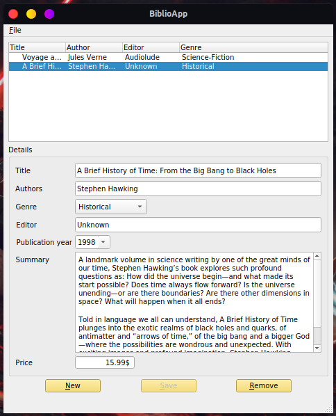

# BiblioApp

[](https://app.codacy.com/manual/faouziMohamed/BiblioApp?utm_source=github.com&utm_medium=referral&utm_content=faouziMohamed/BiblioApp&utm_campaign=Badge_Grade_Dashboard)

A test of using SLQLite in PyQt5 to create a small Library !

## Requirement 

- PyQt5 (or see PySide2)
- Python3.x

- SQLite installed and present in the PATH

## Install requirement

On `conda` environment run :

- **PyQt5**  ```conda install pyqt``` or ```conda install -c anaconda pyqt```
- **PySide2** ```conda install -c conda-forge pyside2```

## Run the main  script

* Clone this repository `https://github.com/faouziMohamed/BiblioApp.git`  and run the main script `main.py`

  ```bash
  git clone https://github.com/faouziMohamed/BiblioApp.git
  cd BiblioApp/src
  python main.py
  ```
## Preview

|                      BiblioApp                       |
| :--------------------------------------------------: |
|  |

